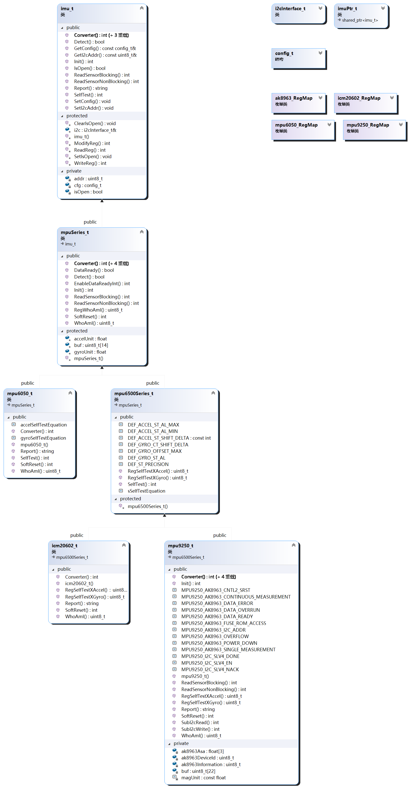

# DRV_IMU_INVENSENSE

[TOC]

## 简介

InvenSense惯性导航驱动库（DRV_IMU_INVENSENSE，简称DRV_IMU_INV），是给MPU6050、MPU9250、ICM20602等InvenSense公司开发的的惯性导航传感器（IMU）设计的驱动。

考虑到该传感器数据量不大，且I2C使用简便可靠，本驱动设计上主要考虑I2C接口。实际应用中如要使用SPI接口，请参见“移植指南 - 移植通信接口 - 使用SPI通信 ”。

**注意：自检的时候保持传感器静止，自检不通过说明传感器内部微机械结构已经出问题了，建议更换传感器**

关于返回值：

返回类型为int的函数返回错误码，为0代表正常，其余全是错误。

返回类型为bool的函数返回`true`代表成功，`false`失败，和返回`int`的函数刚好相反

override方法的注释请参看它在基类中的注释

命名空间：`namespace inv`

## 版本说明

### v1.0-beta.0

by beforelight（网瘾少年） @hitsic 2020-10-16 
改动说明：
- 本驱动重构了在k66工程上的c语言版本的imu驱动，同样支持了3款mpu6050,mpu9250,icm20602，把i2c作为主要接口，并且添加了自检函数，增加使用的可靠性。

开发计划

- 进行进一步测试，验证其稳定性。
- 提供对ICM20948的支持。

已知问题
- 暂无


## API文档



### 类型简介

`class i2cInterface_t;`//i2c接口
`struct config_t;`//设置量程和数字低通滤波器

`class imu_t;`	//imu接口类，抽象出初始化/数据转换/SelfTest/Detect/IO的欸皮埃

`class mpuSeries_t : public imu_t ;`//基类，抽象出invensense的mpu系列以及部分icm系列imu的软复位/中断/温度转换/WhoAmI的api，实现初始化/数据转换/Detect/IO的方法

`class mpu6050_t : public mpuSeries_t;`//mpu6050驱动
`class mpu6500Series_t : public mpuSeries_t;`//基类，实现mpu6500系列以及部分icm系列imu的自检方法

`class icm20602_t : public mpu6500Series_t;`//icm20602驱动
`class mpu9250_t : public mpu6500Series_t;`//mpu9250驱动

`class imuPtr_t : public std::shared_ptr<imu_t>;`//imu_t的智能指针类，用于实例化imu_t对象


详细API文档请参考**头文件**中的注释


## 应用指南

#### 使用步骤

1. 实例化一个`class i2cInterface_t`对象，更多这部分的信息查看移植部分

2. 声明一个`struct config_t`变量并按需修改量程，3db带宽

3. 构建imu类并初始化，这个时候，可能不知道将使用的是哪种陀螺仪，可能是mpu6050，可能是9250，那么实例化一个class imuPtr_t对象并调用其Load方法，例如

   > ```c++
   > inv::config_t cfg;
   > inv::imuPtr_t my_imu;
   > if (0 == my_imu.Load(my_i2c)){
   >     my_imu->Init(cfg);
   > }
   > ```

   如果确定使用哪种陀螺仪，确定用到轮胎磨平，赛道报废永远都不会换其他型号，那么实例化一个具体传感器的驱动比如`class mpu6050_t`，`class icm20602_t`，`class mpu9250_t `，例如只使用MPU6050,则

   > ```c++
   > inv::config_t cfg;
   > inv::mpu6050_t my_imu(my_i2c);
   > my_imu.Init(cfg);
   > ```
   > 
   
4. 自检，调用`SelfTest()`方法自检，自检时保持传感器静止。如果自检多次不通过说明传感器的内部微机械结构已经损坏。如果觉得自检不靠谱也可以跳过自检

5. 调用`ReadSensorBlocking()`方法读取传感器数据并调用Converter()方法转换数据，或者，调用`ReadSensorNonBlocking() `方法，等待数据传输完成之后再调用`Converter()`方法转换数据。

#### 示例代码

这个例子中使用`inv::imuPtr_t`来创建IMU对象

```c++
int remote_i2c_read(void *context,
                    uint8_t addr, uint8_t reg,
                    uint8_t *val, unsigned int len) {
    return static_cast<remote_i2c *>(context)->Read(addr, reg, val, len);
}

int remote_i2c_write(void *context,
                     uint8_t addr, uint8_t reg,
                     const uint8_t *val, unsigned int len) {
    return static_cast<remote_i2c *>(context)->Write(addr, reg, val, len);
}

remote_i2c iic("/dev/i2c-1");
inv::i2cInterface_t my_i2c(&iic, remote_i2c_read, remote_i2c_write,
                           remote_i2c_read, remote_i2c_write);
inv::imuPtr_t my_imu;
uint8_t val;

float acc[3] = {0, 0, 0};
float gyro[3] = {0, 0, 0};
float mag[3] = {0, 0, 0};
//float temp = 0;

int main(int argc, const char **argv) {
    if (0 == my_imu.Load(my_i2c)) {
        if (my_imu->Init() == 0) {
            //自检时保持静止，否则会直接失败
            if (my_imu->SelfTest() == 0) {
                usleep(10000);//等待10ms
                my_imu->ReadSensorBlocking();
                my_imu->Converter(acc, acc + 1, acc + 2, gyro, gyro + 1, gyro + 2);
//                static_cast<inv::mpuSeries_t*>(my_imu.get())->Converter(&temp);
                my_imu->Converter(mag, mag + 1, mag + 2);
                printf("%s\r\n", my_imu->Report().c_str());
                printf("accel \t%.3f \t%.3f \t%.3f m/s^2\r\n", acc[0], acc[1], acc[2]);
                printf("gyro \t%.3f \t%.3f \t%.3f dps \r\n", gyro[0], gyro[1], gyro[2]);
                printf("mag \t%.1f \t%.1f \t%.1f uT \r\n", mag[0], mag[1], mag[2]);
//                printf("temp \t%.3f C \r\n", temp);
            } else {
                printf("自检未通过\r\n");
            }
        } else {
            printf("初始化未通过\r\n");
        }
    } else {
        printf("没有imu\r\n");
    }
    printf("Hello\r\n");
    return 0;
}

```

### 调试功能

定义以下宏以获得相关功能
所有这些控制宏，都在port文件中定义，且采用`#if (defined(YOUR_MACRO) && (YOUR_MACRO >0U)) `
的形式

```C
#define INV_IMU_DEBUG //此宏切换debug总开关，默认关闭
#define INV_PRINTF printf //定义printf函数
#define INV_YES_TRACE //打开代码追踪输出，默认关闭
#define INV_NO_DEBUG  //关闭代码调试输出，默认打开
```


## 移植指南

### 移植通信接口

#### 使用I2C通信

实例化一个`class i2cInterface_t`需要传入1个用户参数，2个I2C阻塞读写函数指针和1个I2C非阻塞读写函数执政

移植需要实现3个I2C读写函数，至少实现其中I2C阻塞读写函数

这两个I2C阻塞读写函数的参数列表和返回值定义以及示例如下，

```c++
/**
 * 
 * @param  {void*} context  : 用户参数
 * @param  {unsigned} char  : iic从机地址
 * @param  {unsigned} char  : 从机寄存器地址
 * @param  {unsigned*} char : 缓存地址
 * @param  {unsigned} int   : 数据长度
 * @return {int}            : 错误码
 */
int remote_i2c_read(void *context,
                    uint8_t addr, uint8_t reg,
                    uint8_t *val, unsigned int len) {
    return static_cast<remote_i2c *>(context)->Read(addr, reg, val, len);
}
/**
 * 
 * @param  {void*} context        : 用户参数
 * @param  {unsigned} char        : iic从机地址
 * @param  {unsigned} char        : 从机寄存器地址
 * @param  {const unsigned*} char : 缓存地址
 * @param  {unsigned} int         : 数据长度
 * @return {int}                  : 错误码
 */
int remote_i2c_write(void *context,
                     uint8_t addr, uint8_t reg,
                     const uint8_t *val, unsigned int len) {
    return static_cast<remote_i2c *>(context)->Write(addr, reg, val, len);
}
```

另外俩个I2C非阻塞读写函数的参数列表和返回值定义和上面俩个完全一样，只不过时前者是阻塞IO，调用后会等传输完成或者发生错误返回，后者时非阻塞IO，调用后会立刻返回，完成数据传输需要另外的方式确认。

如果不打算支撑非阻塞读写I2C，可以不用实现I2C非阻塞读写函数，并在构造时传递相同的函数指针如

```c++
remote_i2c iic("/dev/i2c-1");
inv::i2cInterface_t my_i2c(&iic, remote_i2c_read, remote_i2c_write,
                           remote_i2c_read, remote_i2c_write);
```

关于调试部分请参阅预处理器定义部分

#### 使用SPI通信

确保清楚如何移植驱动，并且知道传感器是否支持SPI接口，之后如移植部分实现那四个函数，并在函数中忽略i2c从机地址，并且按照手册中对SPI传输的规定实现对传感器内部寄存器的读写。

###  添加其他型号的驱动

当前支持的有三款，mpu6050,mpu9250,icm20602，如果要支持其他寄存器结构类似的imu：，步骤如下

1. 继承class imu_t或者class imu_t的子类，然后override基类的方法
2. 如果要使用自动创建已连接传感器的的imu_t对象的话，继承class imuPtr_t并重写Load()方法。


